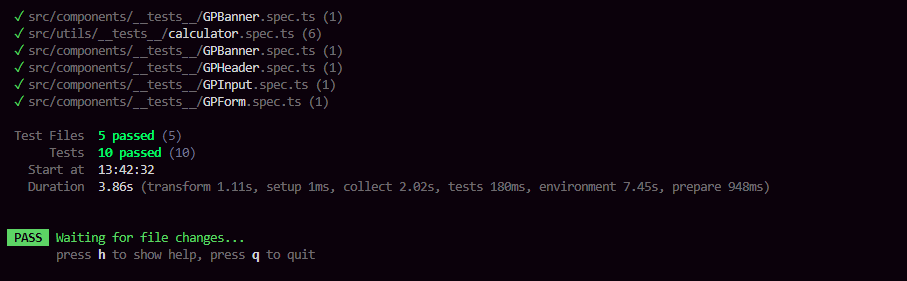
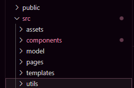

## Fase 3 - Testes Unitários

Foram implementados alguns testes de unidade para validar se os componentes estavam reinderizando corretamente e também se a lógica da aplicação estava correta

Para melhorar os testes a organização das pastas do projeto foi refeita levando em consideração o modelo MVVM (Model-View-View-Model)

A lógica foi separada em um "utils", facilitanto a aplicação do testes unitários e desaclopando os cálculos, caso no futuro seja necessário usá-los em outro lugar, seria só importar os utils

Explicando o restante das pastas: 
Models contém dos os contratos da aplicação;
Pages somente a página da calculadora;
Template está com a Home, que junta o header e o banner e a calculadora, mas no futuro poderiam ter rotas e afins

